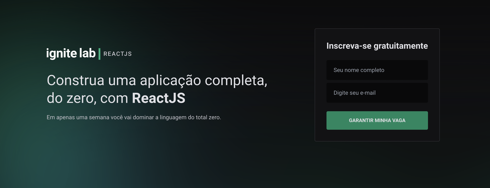

<h1 align="center">
 
Ignite Event Platform 🚀
</h1>

 

 

### Project
<b>A platform that will allow you to watch live and/or recorded class content, complete challenges and participate in the Discord community.</b>
 
 
<b>This project will be made with ReactJS using TypeScript, Tailwindcss to style all the components, GraphCMS to store the contents and GraphQL with Apollo to conect with the GraphCMS.</b>

 

### Figma
Here you can see the project for web and mobile, the state components, and all the styles like fonts, colors, icons, etc: https://www.figma.com/community/file/1120711251998877938

 

### Tools
ReactJS: https://pt-br.reactjs.org  
TypeScript: https://www.typescriptlang.org  
Tailwindcss: https://tailwindcss.com  
Apollo: https://www.apollographql.com/docs/react  
GraphQL: https://graphql.org  
GraphQL Code Generator: https://www.graphql-code-generator.com  
GraphCMS: https://graphcms.com  

 

### 📝 First class - Specialization Start with ReactJS
In this first class was created the project structure using ViteJS with ReactJS and Typescript. Also, we integrated the Apollo/GraphQL with the GraphCMS to get all the contents for the platform. We will use GraphCMS to store the contents like: Lessons, teachers, challenges and subscribers.
 
 
<b>Tools:</b> ReactJS, Apollo, GraphQL Query, GraphCMS.

 

### 📝 Second class - Visual structure
In this class was developed the visual structure of the project and all the components of the sidebar with Tailwindcss getting the informations for lessons from the GraphCMS.
 
 
<b>Tools:</b> Components, Props, Tailwindcss.

 

### 📝 Third class - Routing and Video player
In this class was developed the routing with react-router-dom, a query was made to get lesson data, such as videoId and class data in the sidebar component and used the Link from router-dom to get the video URL (slug).
 
 
<b>Tools:</b> Router, GraphQL Query.

 

### 📝 Fourth class - Subscriber with GraphQL (mutation)
In this class was created a mutation to subscribe the user to GraphCMS on main screen with GraphQL. Navigate the user to the event screen and also, some styles with classnames library on Sidebar.
 
 
<b>Tools:</b> Navigate, GraphQL Mutation, ClassNames.

 

### 📝 Fifth class - GraphQL codegen generator
In this class was used the codegen generator lib to generate all types from GraphCMS.
 
 
<b>Tools:</b> GraphQL Codegen Generator.

 
 

<h3 align="center">
  Made by 🚀 Leonardo Pacciulli
</h3>

  
  
  

